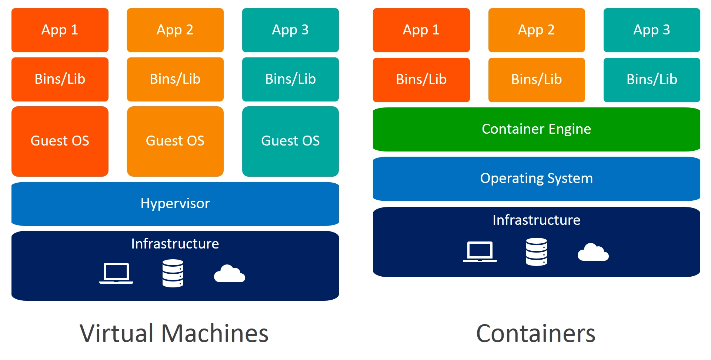
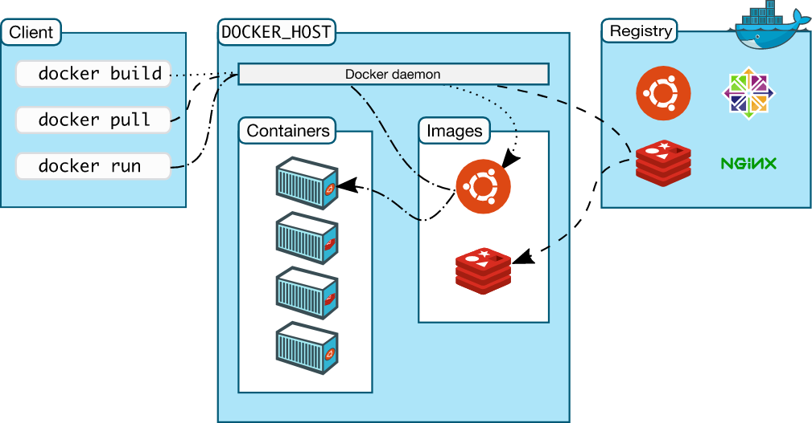

## Docker
Docker is a containerization tool designed to make the devops (dev and ops) teams easier to deploy and run applications by bundling them into containers.Containers allow us to package the application with all of its dependencies which can be run on any platform/environment and Docker follows the concept of containerization.A docker container is a crazy fast light-weight microcomputers, which replace the traditional Virtual Machines.

### Difference between containerization and virtualization(vm's)

The concept of VM's involves multiple guest OS running on the Host OS.So if you develop an application on a VM,then that application uses the libraries and dependencies present on that VM only.The allocation of resources in a vm is done by something called as Hypervisor.Hypervisor takes a portion of our servers resources and allows us to run multiple guest OS.
In containerization,containers share the same OS.There is no Guest OS.That is the libraries and dependencies are that of the Host OS,So processing is faster in case of containerization when compared to virtualization.

In one line virtualization (vm's) virtualize the hardware/resources(cpu,ram etc) and containerization virtualizes the OS.

### VM vs Docker

type       -     VM          Docker
Resources  -     hypervisor  docker engine
Space      -     more space  Less space
speed      -     slow        faster
integration-     no          yes



### Architecture
1. It follows client-server architecture.Here client is the command line argument and server is the docker daemon which can run different docker containers.
2. Once docker  is installed in your Linux system,we need to write a docker file which is built to create a docker image .This image is run to create a docker container.
3. Docker containers are the running instances of docker images.These images cane be pulled from a repository called docker hub or can be build from a docker file.
   All these pull/push/build instructions can be given to docker through cli and the docker daemon executes the instructions on the server. 
4. So multiple members from an organization can share an image by pushing it into docker hub.



### Docker installation in linux
```
step 1:
------
sudo apt-get update
sudo apt-get install -y docker.io (Ubuntu)

(or)
 
sudo yum -y update
sudo yum install -y docker.io (CentOS)

step 2:
-------
docker --version

step 3: start docker
-------
sudo service docker start

step 4: check status of docker
------
sudo service docker status

step 5:stop docker service
------
sudo service docker stop
```

### Some important Docker Commands
1. List all containers 
```commandline
docker ps -a   

root@ubuntu:/home/kmaster# docker ps
CONTAINER ID   IMAGE                  COMMAND                  CREATED       STATUS       PORTS     NAMES
6968cf0a6f50   e03484a90585           "/usr/local/bin/kube…"   2 hours ago   Up 2 hours             k8s_kube-proxy_kube-proxy-mw47z_kube-system_711a541c-df5d-4c8e-b5be-dfb8fd23d7e9_0
9316d61b8ad7   k8s.gcr.io/pause:3.6   "/pause"                 2 hours ago   Up 2 hours             k8s_POD_kube-proxy-mw47z_kube-system_711a541c-df5d-4c8e-b5be-dfb8fd23d7e9_0
ff2d65def738   37c6aeb3663b           "kube-controller-man…"   2 hours ago   Up 2 hours             k8s_kube-controller-manager_kube-controller-manager-ubuntu_kube-system_33f5be0594626f3621b5557b9f5f4fae_0
260c0924f3c6   e6bf5ddd4098           "kube-apiserver --ad…"   2 hours ago   Up 2 hours             k8s_kube-apiserver_kube-apiserver-ubuntu_kube-system_1673c7d91520670f71baaa4f405dafcb_0
6985d226e28e   56c5af1d00b5           "kube-scheduler --au…"   2 hours ago   Up 2 hours             k8s_kube-scheduler_kube-scheduler-ubuntu_kube-system_a657a0d9b61dcf5c148e8111e8e757a7_0
88cad41b56b8   25f8c7f3da61           "etcd --advertise-cl…"   2 hours ago   Up 2 hours             k8s_etcd_etcd-ubuntu_kube-system_ed6aa9ad4f1a715a1907ebc6ed10a42e_0
70bf8e30633a   k8s.gcr.io/pause:3.6   "/pause"                 2 hours ago   Up 2 hours             k8s_POD_kube-apiserver-ubuntu_kube-system_1673c7d91520670f71baaa4f405dafcb_0
5a3920253e3c   k8s.gcr.io/pause:3.6   "/pause"                 2 hours ago   Up 2 hours             k8s_POD_etcd-ubuntu_kube-system_ed6aa9ad4f1a715a1907ebc6ed10a42e_0
51ffc48a0151   k8s.gcr.io/pause:3.6   "/pause"                 2 hours ago   Up 2 hours             k8s_POD_kube-controller-manager-ubuntu_kube-system_33f5be0594626f3621b5557b9f5f4fae_0
6a0c5eb9bd42   k8s.gcr.io/pause:3.6   "/pause"                 2 hours ago   Up 2 hours             k8s_POD_kube-scheduler-ubuntu_kube-system_a657a0d9b61dcf5c148e8111e8e757a7_0
root@ubuntu:/home/kmaster# 

```

2. List all images
```commandline
docker images 

root@ubuntu:/home/kmaster# docker images
REPOSITORY                           TAG       IMAGE ID       CREATED        SIZE
k8s.gcr.io/kube-apiserver            v1.23.0   e6bf5ddd4098   14 hours ago   135MB
k8s.gcr.io/kube-scheduler            v1.23.0   56c5af1d00b5   14 hours ago   53.5MB
k8s.gcr.io/kube-proxy                v1.23.0   e03484a90585   14 hours ago   112MB
k8s.gcr.io/kube-controller-manager   v1.23.0   37c6aeb3663b   14 hours ago   125MB
k8s.gcr.io/etcd                      3.5.1-0   25f8c7f3da61   5 weeks ago    293MB
k8s.gcr.io/coredns/coredns           v1.8.6    a4ca41631cc7   2 months ago   46.8MB
k8s.gcr.io/pause                     3.6       6270bb605e12   3 months ago   683kB
```

3. Run a container using the image

```commandline
docker run <image_name>

root@ubuntu:/home/kmaster# docker run -it alpine
Unable to find image 'alpine:latest' locally
latest: Pulling from library/alpine
59bf1c3509f3: Pull complete 
Digest: sha256:21a3deaa0d32a8057914f36584b5288d2e5ecc984380bc0118285c70fa8c9300
Status: Downloaded newer image for alpine:latest
/ # ls
bin    dev    etc    home   lib    media  mnt    opt    proc   root   run    sbin   srv    sys    tmp    usr    var
/ #
```

4. Stop a running container
```commandline
docker stop <conatiner id>
docker stop $(docker ps -a -q) --to stop all conatiners
docker rm -f $(docker ps -a -q) --to stop and remove conatiners

root@ubuntu:/home/kmaster# docker stop c0756736a1ee
c0756736a1ee
root@ubuntu:/home/kmaster#
```

5. Build image form a docker file 
```commandline
docker build -t <image_name>:<tag> <dockerfile -- location or build context>
docker build -t base_test -f base/Dockerfile   -- if file is is other location

```

6. Remove image 
```commandline
docker rmi <image_name>:<tag_name>

root@ubuntu:/home/kmaster# docker rmi -f alpine (-f to force remove will first remove the container using it and then the image)
Untagged: alpine:latest
Untagged: alpine@sha256:21a3deaa0d32a8057914f36584b5288d2e5ecc984380bc0118285c70fa8c9300
Deleted: sha256:c059bfaa849c4d8e4aecaeb3a10c2d9b3d85f5165c66ad3a4d937758128c4d18
root@ubuntu:/home/kmaster#
```

7. Save an image as a tar file for shipping
```commandline
docker save <image_name>> | gzip > <tar_name>>.tar.gz

root@ubuntu:/home/kmaster# docker save base_image:v0.2.13 | gzip > base_image_v_0_1_13.tar.gz
```
 
8. Load an image back into local
```commandline
docker load <tar_name>>
```

9. To get the history of how an image was created

```commandline
docker history <image_name>
[user@node ~]$ docker history hive-metastore
IMAGE          CREATED         CREATED BY                                      SIZE      COMMENT
3290f19f756b   5 minutes ago   /bin/sh -c #(nop) COPY file:7adf07644e5f1b9e…   970B
61162376913f   5 minutes ago   /bin/sh -c #(nop) ADD file:b384b119fbc5350c1…   4.02kB
1fc73f27921f   5 minutes ago   /bin/sh -c #(nop) ADD file:e6ee73a4d2e00cf1a…   41.2kB
8ddfab2330a3   5 minutes ago   /bin/sh -c export LANGUAGE=en_US.UTF-8          0B
```

10. To rename and push the image into container registry
```commandline
docker tag myimage:1.0  myrepo/myimage:2.0  -- rename and tag to a newer name
docker push myrepo/myimage:2.0              -- push the image to docker hub/any other registry
```

11. To check container logs
```commandline
docker logs --tail 10 <conatiner_id>  

root@ubuntu:/home/kmaster# docker logs --tail 10 ff2d65def738  
I1208 06:13:34.759510       1 garbagecollector.go:155] Garbage collector: all resource monitors have synced. Proceeding to collect garbage
I1208 06:13:34.803114       1 shared_informer.go:247] Caches are synced for garbage collector 
I1208 06:13:34.855999       1 event.go:294] "Event occurred" object="kube-system/kube-proxy" kind="DaemonSet" apiVersion="apps/v1" type="Normal" reason="SuccessfulCreate" message="Created pod: kube-proxy-mw47z"
I1208 06:13:34.946861       1 event.go:294] "Event occurred" object="kube-system/coredns" kind="Deployment" apiVersion="apps/v1" type="Normal" reason="ScalingReplicaSet" message="Scaled up replica set coredns-64897985d to 2"
I1208 06:13:35.124883       1 event.go:294] "Event occurred" object="kube-system/coredns-64897985d" kind="ReplicaSet" apiVersion="apps/v1" type="Normal" reason="SuccessfulCreate" message="Created pod: coredns-64897985d-zxnbg"

```

### Docker File
This file contains instructions for building a docker image.Docker file is a text file where you write the instructions needed to build a docker image.Docker can build images automatically by reading the instructions from a Dockerfile.

#### Docker build
```
docker build -t <image_name:tag_name> <Dockerfile location or build context>
docker build -t base_test -f base/Dockerfile .	--if file is is other location
```
1. The build will be done by docker daemon.Before the Docker daemon runs the instructions in the Dockerfile, it performs a preliminary validation of the Dockerfile and returns an error if the syntax is incorrect.
2. When you issue a docker build command, the current working directory is the build context. By default, the Dockerfile is assumed to be located here, but you can specify a different location with the file flag (-f). Regardless of where the Dockerfile actually lives, all recursive contents of files and directories in the current directory are sent to the Docker daemon as the build context.
3. The Docker daemon runs the instructions in the Dockerfile one-by-one, committing the result of each instruction to a new image if necessary, before finally outputting the ID of your new image. The Docker daemon will automatically clean up the context you sent.

Note that each instruction is run independently, and causes a new image to be created.Example shown below:

```
[user@node ~]$ docker history hive-metastore
IMAGE          CREATED         CREATED BY                                      SIZE      COMMENT
3290f19f756b   5 minutes ago   /bin/sh -c #(nop) COPY file:7adf07644e5f1b9e…   970B
61162376913f   5 minutes ago   /bin/sh -c #(nop) ADD file:b384b119fbc5350c1…   4.02kB
1fc73f27921f   5 minutes ago   /bin/sh -c #(nop) ADD file:e6ee73a4d2e00cf1a…   41.2kB
8ddfab2330a3   5 minutes ago   /bin/sh -c export LANGUAGE=en_US.UTF-8          0B

```

### Keywords in Dockerfile

Docker file contains comments,commands and arguments
```commandline
1.  FROM- specifies the base docker image.All other customizations will be on top of base image.The base image can be an existing open-source image or a custom image
EX: FROM <image_name>

2.  RUN- Is used to Run linux commands or any command.
EX: RUN apt-get install java

3.  CMD- It is also used to run commands but is not used for building an image.There can only be one CMD instruction in a Dockerfile. CMD is an instruction that is best to use if you need a default command which users can easily override.
EX: CMD "echo" "Welcome to Hyd"

4. ENTRYPOINT-The command specified with entrypoint is executed first when container is run .ENTRYPOINT is preferred when you want to define a container with a specific executable
EX: ENTRYPOINT echo
    CMD "Welcome" //cmd is am arg to the entrypoint.NOTE: any arg given while running a container will be appended to the ENTRYPOINT and will be replaced if it is a CMD
    
    Example Docker file :
    Dockerfile1
    From Ubuntu
    CMD sleep 5
    
    docker build -t ubuntu-sleeper .
    
    docker run ubuntu-sleeper sleep 10  ## here sleep 10 will be replaced by sleep 5
    
    Dockerfile 2
    From Ubuntu
    ENTRYPOINT ["sleep"]
    CMD ["5"]
    
    docker run ubuntu-sleeper 10  ## here sleep 10 will be appended to entrypoint sleep,i.e.., sleep 10
    If nothing is specified then sleep 5 will run ie.., cmd will be appended to entrypoint. If cmd is not specifed and the above command is run then you will get an error.
    
   We can also override entrypoint command using --entrypoint option while running the container.
    
5. ADD/COPY-copy files from onr dir to another directory.Preferrably use COPY.
EX:ADD[source dir/URL] [destinatiom]

6. ENV- set environment variables
EX:ENV PATH /s/d

7. WORKDIR-to specify which place the CMD command needs to be executed/
EX:WORKDIR-/path

8. EXPOSE-to expose your host port
EX:Expose 8080

9. MAINTAINER-who is maintaining the docker image.should be present after FROM command
EX:MAINTAINER <author>//non executing command

10. VOLUME- to set a custom path where your container will store all your files.If we want multiple containers to share the same path then we can use Volume.
EX:VOLUME ["/dir_1","dir_2"...]

```
An example with all the instructions above are present in the code/docker/services folder.

### Run a docker file
Below is the complete command to run a docker container with all the options
```
docker run -rm -it  -d -e key=value -p outer:inner -v host_path:conatiner_path <image_name> bash
```
1. When you start a container with docker run, behind the scenes Docker creates a set of namespaces and control groups for the container.
2. Namespaces provide  straightforward form of isolation: processes running within a container cannot see, and even less affect, processes running in another container, or in the host system.
3. Control Groups are another key component of Linux Containers. They implement resource accounting and limiting. They provide many useful metrics, but they also help ensure that each container gets its fair share of memory, CPU, disk I/O; and, more importantly, that a single container cannot bring the system down by exhausting one of those resources.


## Docker Volumes
Docker volumes are used for data persistence.Whenever we spin up a docker container using a simple docker run command for ex:
```docker run --name nginx-image --image nginx```
docker creates a directory in /var/lib/docker/volumes/<hash>/<volname>/data on the host machine where the container data is stored. When the container is removed the directory is also deleted.
If we don't want data to be deleted if the docker container crashes, we use docker volumes. By using docker volumes we are mounting a directory on the host machine to a directory in container so that even if the container is removed the data still persists on the host and when the container is restarted again the data is available as it is.
Ex: Volumes are mostly used when we are working with Database containers where we dont want to loose the data even though the container is lost

### Types of volumes
1. anonymous volumes: docker run -v /data01 -docker managed
2. named volume: docker run -v db_data:/data01 - docker managed (prefered)
3. bind volumes/mount : docker run -v /opt/data02:/data01 --not managed by docker


## Docker Security
 Docker containers and hosts share the same kernel but are isolated from each other as they run in their own namespace.The host has a namespace and containers have their own namespace. 
 You can use a user to create a container instead of allowing the operations inside a container as root.


### Manage docker as a non-root user:
Whenever you try to run commands using non-root user,you will see the below error and that's because you are non-root.
```commandline
kmaster@ubuntu:~$ docker ps
Got permission denied while trying to connect to the Docker daemon socket at unix:///var/run/docker.sock: Get http://%2Fvar%2Frun%2Fdocker.sock/v1.24/containers/json: dial unix /var/run/docker.sock: connect: permission denied
kmaster@ubuntu:~$
```
Solution:
To create the docker group and add your user:
Create the docker group.
```
$ sudo groupadd docker
Add your user to the docker group.

$ sudo usermod -aG docker $USER
Log out and log back in so that your group membership is re-evaluated.
```


## DockerFile best practices:
1. Use base images with tags
2. Dont install unnecessary packages using apt-get
3. Use multistage builds to reduce the size of the image.
4. Run the docker container as a non-root user

Docker containers typically run with root privileges by default. This allows for unrestricted container management, which means you can do things like install system packages, edit config files, bind privileged ports, etc. This is really useful for development purposes, but can expose you to high risk once you put your containers into a production environment.

Docker Model suggests that it is better to run a single service within a container. If you wanted to build an application that required an Apache service and a MariaDB database, you should generate two different containers.
Thus docker doesn’t need systemd which is tool for monitoring multiple services.Thus it is disabled by default and to enhance security and isolation to container and its service.

Any linux Process with PID 1 acts as the Entrypoint of the container or simply you can say it is the first process invoked by the kernel.In modern systems PID 1 is actively reserved for the init process but not in docker.

### Privileged vs Non-Privileged containers:

A privileged container has all the capabilities a host can perform. And that’s a bad idea.
To prevent security issues, it is recomended that you do not run privileged containers in your environment. Instead, provide granular permissions and capabilities to the container environment. Giving containers full access to the host can create security flaws in your production environment. This is the reason that, by default, containers are “unprivileged” and cannot access all the devices in the host.Running a privileged container is different from running a container using the user root inside it, which should also be avoided. 

Changing the configuration of your containers to make them run as non-root adds an extra layer of security.
Example1 : https://medium.com/jobteaser-dev-team/docker-user-best-practices-a8d2ca5205f4
Example2 : https://www.docker.com/blog/intro-guide-to-dockerfile-best-practices/

NOTE: The root user capabilities are not same as the container root user capabilities,bot of them are different from each other.

## DockerCompose

Compose is a tool for defining and running multi-container Docker applications. With Compose, you use a YAML file to configure your application’s services. Then, with a single command, you create and start all the services from your configuration

Using Compose is basically a three-step process:
 1. Define your app’s environment with a Dockerfile so it can be reproduced anywhere.
 2. Define the services that make up your app in docker-compose.yml so they can be run together in an isolated environment.
 3. Run docker-compose up and Compose starts and runs your entire app.

```
docker-compose up -d ---for staring containers
docker-copose down --for stopping and removing all containers
```
### docker compose for services
Refer to docker-compose.yml in code folder for example
		