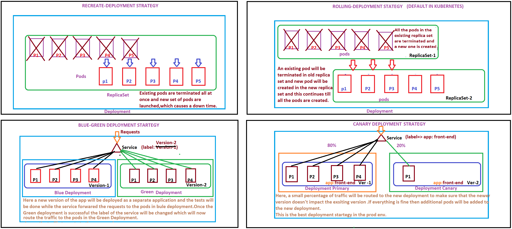

# Container Orchestration

Automatically deploying and managing containers is called Container Orchestration.It automates the deployment,
management, scaling, and networking of containers. Examples of Container Orchestration Technologies are:

1. Docker Swarm
2. Kubernetes
3. Mesos
The blow document consists of Kubernetes notes/cheat sheet and all the important concepts related to CKAD Certification

# Table of contents

- [Container Orchestration](#container-orchestration)
- [Kubernetes](#kubernetes)
    - [Definition](#definition)
    - [Architecture](#architecture)
    - [Components of kubernetes Control plane](#components-of-kubernetes-control-plane)
    - [Internal working](#internal-working)
    - [PODs](#pods)
      - [Example](#example)
      - [Some Pod commands](#some-pod-commands)
      - [MultiContainer Pods](#multicontainer-pods)
        - [Example](#example)
    - [Replica Sets](#replica-sets)
      - [Example](#example)
      - [Some ReplicaSet Commands](#some-replicaset-commands)
    - [Deployments](#deployments)
      - [Example](#example)
      - [Some Deployment Commands](#some-deployment-commands)
      - [Updates and rollbacks to a deployment](#updates-and-rollbacks-to-a-deployment)
    - [Namespaces in kubernetes](#namespaces-in-kubernetes)
      - [Example](#example)
      - [Some Namespace Commands](#some-namespace-commands)
    - [Environment Variables](#environment-variables)
      - [Plain key-value](#plain-key-value)
      - [Config Maps](#config-maps)
        - [Config map commands](#config-map-commands)
      - [Secrets](#secrets)
        - [Secrets-commands](#secrets-commands)
    - [Security Context in Kubernetes](#security-context-in-kubernetes)
    - [Resource Requirements](#resource-requirements)
    - [Taints and Toleration](#taints-and-toleration)
      - [Taint commands example](#taint-commands-example)
    - [Node Selectors and Node Affinity](#node-selectors-and-node-affinity)
    - [Kubernetes Services](#kubernetes-services)
      - [Types of services](#types-of-services)
        - [Node Port Service](#node-port-service)
        - [Cluster IP Service](#cluster-ip-service)
        - [Node Port Service](#node-port-service)
    - [Observability](#observability)
      - [Readiness Probes](#readiness-probes)
      - [Liveness Probes](#liveness-probes)
    - [Logging in Kubernetes](#logging-in-kubernetes)
    - [Monitoring](#monitoring)
    - [Volumes](#volumes)
      - [Persistence Volumes](#persistence-volumes)
      - [Persistence Volume Claim](#persistence-volume-claim)
        - [Using PVC's in Pods/Deployments/Replicasets](#using-pvcs-in-podsdeploymentsreplicasets)
    - [Storage Classes](#storage-classes)
    - [Stateful Sets](#stateful-sets) 

# Kubernetes

### Definition

Kubernetes is a portable, extensible, open-source platform for deploying and managing containerized workloads and
services, that facilitates both declarative configuration and automation. Containers are a good way to bundle and run
your applications. In a production environment, you need to manage the containers that run the applications and ensure
that there is no downtime. For example, if a container goes down, another container needs to start. Wouldn't it be
easier if this behavior was handled by a system?

That's how Kubernetes comes to the rescue! Kubernetes provides you with a framework to run distributed systems
resiliently. It takes care of scaling and failover for your application, provides deployment patterns, and more.

### Architecture

Kubernetes Architecture has the following main components:

1. Master node
2. Worker/Slave nodes

### Components of kubernetes Control plane

Master components:

1. kube api-server (front end for kubernetes which takes requests from clients)
2. etcd (key-value store for storing cluster data and changes if any in distributed manner)
3. scheduler(distributing load across nodes)
4. controllers (to scale containers (brain behind orchestration)

Worker components:

5. container runtime (env to run container ex. docker)
6. kubelet (agent that runs on each node on the cluster to give health info to the master)
7. kubeproxy (maintaines network rules on the nodes)
8. pods(a kubernetes object where the application is deployed)

### Internal working

Whenever client executes a command from the cli the request goes to the kube-api server on the master, and then the
api-server validates the request and sends it to the scheduler .The scheduler decides based on an algorithm on which
node will the pod get deployed and then send a request/info to the kubelet agent which is running on the node .The
kubelet agent is then responsible to execute the instruction passed by the scheduler . Once the execution is completed
the changes (like creation of a pod/service etc) on the server are then registered as a key value pair in etcd server.
The kubelet agent periodically sends the node status to the kube-api server so that it is informed if anything goes
down.

### PODs

Kubernetes doesn't directly deploy containers on the nodes.The containers are en-capsulated into a kubernetes object
called as pod.I

1. A pod is a single instance of an application.It encapsulates your container application for deploying into kubernetes
   cluster.
2. A pod always has one to one relationship with the application.The smallest unit you can create in Kubernetes object
   model is POD.
3. We can have multiple containers within a single pod but they have to be containers of a different kind or any helper
   container.All the containers within a pod share the same network(can communicate as localhost) and same storage
   space.
4. An Ip address is assigned to a pod (range --10.244.0.0).Every POD has a separate IP assigned.Pods communicate though
   this internal IP
5. kubernetes uses yaml files as inputs for creation of objects like pods/deployments/replica-sets etc.Below is an
   example of nginx-definition.yml file. Example pod:

#### Example

```yaml
apiVersion: v1
kind: Pod
metadata:
  name: nginx
  namespace: dev
spec:
  containers:
    - name: nginx
      image: nginx:1.14.2
      ports:
        - containerPort: 80
```

NOTE: All the kubectl commands which are used for pod and the corresponding outputs can be seen in code/kubernetes
section

#### Some Pod commands

1. Get cluster info where the control plane(the one which manages the whole kubernetes cluster ex:
   kube-api/etcd/controllers etc) is running

```commandline
controlplane ~ ➜  kubectl cluster-info
Kubernetes control plane is running at https://127.0.0.1:6443
CoreDNS is running at https://127.0.0.1:6443/api/v1/namespaces/kube-system/services/kube-dns:dns/proxy
Metrics-server is running at https://127.0.0.1:6443/api/v1/namespaces/kube-system/services/https:metrics-server:/proxy

To further debug and diagnose cluster problems, use 'kubectl cluster-info dump'.
```

2. Get pods in a namespace and all namespaces

```commandline
controlplane ~ ➜  kubectl get pods -n kube-system
NAME                                     READY   STATUS      RESTARTS   AGE
helm-install-traefik-crd--1-nbv84        0/1     Completed   0          13m
helm-install-traefik--1-4ngs6            0/1     Completed   1          13m
traefik-74dd4975f9-l4cng                 1/1     Running     0          13m
coredns-85cb69466-r5wz4                  1/1     Running     0          13m
local-path-provisioner-64ffb68fd-sqv9v   1/1     Running     0          13m
metrics-server-9cf544f65-8d88v           1/1     Running     0          13m
svclb-traefik-mbkcc                      2/2     Running     0          13m

controlplane ~ ➜  kubectl get pods
No resources found in default namespace. //default namespace is default


controlplane ~ ➜  kubectl get pods --all-namespaces
NAMESPACE     NAME                                     READY   STATUS      RESTARTS   AGE
kube-system   helm-install-traefik-crd--1-nbv84        0/1     Completed   0          17m
kube-system   helm-install-traefik--1-4ngs6            0/1     Completed   1          17m
kube-system   traefik-74dd4975f9-l4cng                 1/1     Running     0          16m
kube-system   coredns-85cb69466-r5wz4                  1/1     Running     0          17m
kube-system   local-path-provisioner-64ffb68fd-sqv9v   1/1     Running     0          17m
kube-system   metrics-server-9cf544f65-8d88v           1/1     Running     0          17m
kube-system   svclb-traefik-mbkcc                      2/2     Running     0          16m
default       nginx                                    1/1     Running     0          89s

```

3. Run a pod directly without any yaml config.

```commandline
controlplane ~ ➜  kubectl run nginx --image=nginx 
pod/nginx created

controlplane ~ ➜  kubectl get pods
NAME    READY   STATUS    RESTARTS   AGE
nginx   1/1     Running   0          4s
```

4. Get pods with additional details

```commandline
controlplane ~ ➜  kubectl get pods -o wide 
NAME    READY   STATUS    RESTARTS   AGE    IP           NODE           NOMINATED NODE   READINESS GATES
nginx   1/1     Running   0          3m1s   10.42.0.12   controlplane   <none>           <none>
```

5. Describe pod

```commandline
controlplane ~ ➜  kubectl describe pod nginx
Name:         nginx
Namespace:    default
Priority:     0
Node:         controlplane/172.25.0.83
Start Time:   Fri, 10 Dec 2021 13:06:54 +0000
Labels:       run=nginx
Annotations:  <none>
Status:       Running
IP:           10.42.0.12
IPs:
  IP:  10.42.0.12
Containers:
  nginx:
    Container ID:   containerd://13491aefc4542d2fb0efda06cee50fe969efaf71ba359e89cec183950f213164
    Image:          nginx
    Image ID:       docker.io/library/nginx@sha256:9522864dd661dcadfd9958f9e0de192a1fdda2c162a35668ab6ac42b465f0603
    Port:           <none>
    Host Port:      <none>
    State:          Running
      Started:      Fri, 10 Dec 2021 13:06:56 +0000
    Ready:          True
    Restart Count:  0
    Environment:    <none>
    Mounts:
      /var/run/secrets/kubernetes.io/serviceaccount from kube-api-access-fkdhj (ro)
Conditions:
  Type              Status
  Initialized       True 
  Ready             True 
  ContainersReady   True 
  PodScheduled      True 
Volumes:
  kube-api-access-fkdhj:
    Type:                    Projected (a volume that contains injected data from multiple sources)
    TokenExpirationSeconds:  3607
    ConfigMapName:           kube-root-ca.crt
    ConfigMapOptional:       <nil>
    DownwardAPI:             true
QoS Class:                   BestEffort
Node-Selectors:              <none>
Tolerations:                 node.kubernetes.io/not-ready:NoExecute op=Exists for 300s
                             node.kubernetes.io/unreachable:NoExecute op=Exists for 300s
Events:
  Type    Reason     Age    From               Message
  ----    ------     ----   ----               -------
  Normal  Scheduled  4m58s  default-scheduler  Successfully assigned default/nginx to controlplane
  Normal  Pulling    4m57s  kubelet            Pulling image "nginx"
  Normal  Pulled     4m57s  kubelet            Successfully pulled image "nginx" in 172.977384ms
  Normal  Created    4m57s  kubelet            Created container nginx
  Normal  Started    4m56s  kubelet            Started container nginx

```

6. Get inside a pod

```commandline
controlplane ~ ➜  kubectl exec -it nginx -- /bin/bash
root@nginx:/# ls
bin  boot  dev  docker-entrypoint.d  docker-entrypoint.sh  etc  home  lib  lib64  media  mnt  opt  proc  root  run  sbin  srv  sys  tmp  usr  var
root@nginx:/# hostname -i
10.42.0.12
root@nginx:/# hostname   
nginx
root@nginx:/# exit
exit

```

7. Get pod logs

```commandline
controlplane ~ ➜  kubectl logs -f nginx
/docker-entrypoint.sh: /docker-entrypoint.d/ is not empty, will attempt to perform configuration
/docker-entrypoint.sh: Looking for shell scripts in /docker-entrypoint.d/
/docker-entrypoint.sh: Launching /docker-entrypoint.d/10-listen-on-ipv6-by-default.sh
10-listen-on-ipv6-by-default.sh: info: Getting the checksum of /etc/nginx/conf.d/default.conf
10-listen-on-ipv6-by-default.sh: info: Enabled listen on IPv6 in /etc/nginx/conf.d/default.conf
/docker-entrypoint.sh: Launching /docker-entrypoint.d/20-envsubst-on-templates.sh
/docker-entrypoint.sh: Launching /docker-entrypoint.d/30-tune-worker-processes.sh
```

8. Creating a pod def file and starting a sample pod

```commandline
controlplane ~ ➜  cat sample-pod.yaml 
apiVersion: v1
kind: Pod
metadata: 
   name: dummy-pod
   labels:
     app: sample-dummy-app
spec:
   containers:
     - name: sample-conatiner
       image: alpine
       command: ["sleep"]
       args: ["100"]
   restartPolicy: OnFailure

controlplane ~ ➜  kubectl create -f sample-pod.yaml 
pod/dummy-pod created

controlplane ~ ➜  kubectl get pods
NAME        READY   STATUS    RESTARTS   AGE
nginx       1/1     Running   0          30m
dummy-pod   1/1     Running   0          20s

controlplane ~ ➜  kubectl create -f postgres-pod.-def.yaml
pod/postgres created
controlplane ~ ➜  kubectl get pods
NAME       READY   STATUS    RESTARTS   AGE
postgres   1/1     Running   0          7m21s

controlplane ~ ➜  kubectl exec -it postgres bash
kubectl exec [POD] [COMMAND] is DEPRECATED and will be removed in a future version. Use kubectl exec [POD] -- [COMMAND] instead.
root@postgres:/# psql -U postgres
psql (14.1 (Debian 14.1-1.pgdg110+1))
Type "help" for help.

postgres=# select 1;
 ?column? 
----------
        1
(1 row)

postgres=# 
```

9. Edit a pod-definition file

```commandline
controlplane ~ ➜  kubectl edit pod postgres
pod/postgres created edited
```

10. Generate a pod manifest file (i.e.., do a dry run which check whether the object can be created or not)

```commandline
kubectl run nginx --image=nginx --dry-run=client -o yaml

kubectl create deployment --image=nginx nginx --dry-run -o yaml
```

#### MultiContainer Pods

We can have more than one container in a single pod and this is known as multi-container pods.The containers within this
pod share the same network and storage.\
Example of a multi container pod is present in code section

##### Example

```commandline
root@controlplane:~# cat multi-container-pod.yml 
apiVersion: v1
kind: Pod
metadata:
  name: multicontainer-pods
spec:
  containers:
  - name: application-1
    image: nginx
    volumeMounts:
    - name: html
      mountPath: /usr/share/nginx/html
  - name: application-2
    image: debian
    volumeMounts:
    - name: html
      mountPath: /html
    command: ["/bin/sh", "-c"]
    args:
      - while true; do
          date >> /html/index.html;
          sleep 1;
        done
  volumes:
    - name: html
      emptyDir: { }

root@controlplane:~# kubectl get pods multicontainer-pods 
NAME                  READY   STATUS    RESTARTS   AGE
multicontainer-pods   2/2     Running   0          38s

root@controlplane:~# kubectl exec -it multicontainer-pods -c application-1 -- /bin/bash
root@multicontainer-pods:/# 
```

### Replica Sets

Replication controllers are the processes which monitor Kubernetes objects and respond accordingly. Q. Why do we need a
replication controller? It helps us run multiple instances of a single pod ,thus providing high availability.

Replication Controller is the older tech. replaced by replica set Replica-set needs a selector definition which helps
the replic set identify which pods come under it because Replica set can also manage the pods that were not created as a
part of replica set.

Q. Why do we need selectors and labels ? So that we can monitor/manage existing pods as well and if the pods are not
created ,replica set will create for you. As a result,labels act as a filter for the replica-set i.e.., monitor if
already exists and create if not exists.

#### Example

```yaml
apiVersion: apps/v1
kind: ReplicaSet
metadata:
  name: dummy-pod
  labels:
    app: sample-dummy-app
spec:
  template:
    metadata:
  name: dummy-pod
  labels:
    app: sample-dummy-app
  spec:
    containers:
      - name: sample-conatiner
        image: alpine
        command: [ "sleep" ]
        args: [ "100" ]
  replicas: 3
  selector:
    matchLabels:
      app: sample-dummy-app       
```

#### Some ReplicaSet Commands

1. Get existing replica sets from a namespace

```commandline
controlplane ~ ➜  kubectl get replicasets -n default
NAME                   DESIRED   CURRENT   READY   AGE
postgres-replica-set   2         2         2       16m

controlplane ~ ➜ 
```

2. Create a replica-set

```commandline
controlplane ~ ➜  cat postgres-rep-def.yml 
apiVersion: apps/v1
kind: ReplicaSet
metadata:
  name: postgres-replica-set
  labels:
    tier: db-tier
spec:
  template:
    metadata:
      name: postgres
      labels:
        tier: db-tier
    spec:
      containers:
        - name: postgres
          image: postgres
          ports:
            - containerPort: 5432
          env:
            - name: POSTGRES_PASSWORD
              value: mysecretpassword
  replicas: 2
  selector: 
    matchLabels:
      tier: db-tier

controlplane ~ ➜  kubectl create -f postgres-rep-def.yml 
replicaset.apps/postgres-replica-set created

controlplane ~ ➜  kubectl get pods
NAME                         READY   STATUS    RESTARTS   AGE
postgres-replica-set-ng6tq   1/1     Running   0          18m
postgres-replica-set-4chjz   1/1     Running   0          18m
```

3. Scale a replica set

```commandline
controlplane ~ ➜  kubectl scale --replicas=3 -f postgres-rep-def.yml 
replicaset.apps/postgres-replica-set scaled

controlplane ~ ➜  kubectl get pods
NAME                         READY   STATUS    RESTARTS   AGE
postgres-replica-set-ng6tq   1/1     Running   0          19m
postgres-replica-set-4chjz   1/1     Running   0          19m
postgres-replica-set-jzgnh   1/1     Running   0          4s
```

4. Delete a replica set (also deletes the underlying pods)

```commandline
controlplane ~ ➜  kubectl delete replicaset postgres-replica-set 
replicaset.apps "postgres-replica-set" deleted

controlplane ~ ➜  kubectl get replicasets -n default
No resources found in default namespace.

controlplane ~ ➜  kubectl get pods
No resources found in default namespace.
```

### Deployments

A deployment is a top level kubernetes object which creates a replicaset and their corresponding pods and is responsible
for rolling updates/rollback etc. Provides capability of updating the underlying pods using rolling updates/undo changes
etc. Same syntax of the yaml file same as that of replica set definition.

#### Example

```yaml
apiVersion: apps/v1
kind: Deployment
metadata:
  name: postgres-deployment
  labels:
    tier: db-tier
spec:
  template:
    metadata:
      name: postgres
      labels:
        tier: db-tier
    spec:
      containers:
        - name: postgres
          image: postgres
          ports:
            - containerPort: 5432
          env:
            - name: POSTGRES_PASSWORD
              value: mysecretpassword
  replicas: 2
  selector:
    matchLabels:
      tier: db-tier
```

#### Some Deployment Commands

1. Get existing deployments from a namespace

```commandline
controlplane ~ ➜  kubectl get deployments
NAME                  READY   UP-TO-DATE   AVAILABLE   AGE
postgres-deployment   2/2     2            2           32s
```

2. Create a deployment

```commandline
controlplane ~ ➜  cat postgres-dep-def.yml 
apiVersion: apps/v1
kind: Deployment
metadata:
  name: postgres-deployment
  labels:
    tier: db-tier
spec:
  template:
    metadata:
      name: postgres
      labels:
        tier: db-tier
    spec:
      containers:
        - name: postgres
          image: postgres
          ports:
            - containerPort: 5432
          env:
            - name: POSTGRES_PASSWORD
              value: mysecretpassword
  replicas: 2
  selector: 
    matchLabels:
      tier: db-tier

controlplane ~ ➜  kubectl create -f postgres-dep-def.yml 
deployment.apps/postgres-deployment created

controlplane ~ ➜  kubectl get deployments
NAME                  READY   UP-TO-DATE   AVAILABLE   AGE
postgres-deployment   2/2     2            2           32s

controlplane ~ ✖ kubectl get replicaset
NAME                             DESIRED   CURRENT   READY   AGE
postgres-deployment-7f986b9ccb   2         2         2       22s 

controlplane ~ ➜  kubectl get pods
NAME                         READY   STATUS    RESTARTS   AGE
postgres-replica-set-ng6tq   1/1     Running   0          18m
postgres-replica-set-4chjz   1/1     Running   0          18m
```

3. Scale a deployment

```commandline
controlplane ~ ➜  kubectl scale --replicas=3 -f postgres-dep-def.yml 
replicaset.apps/postgres-replica-set scaled

controlplane ~ ➜  kubectl get pods
NAME                         READY   STATUS    RESTARTS   AGE
postgres-replica-set-ng6tq   1/1     Running   0          19m
postgres-replica-set-4chjz   1/1     Running   0          19m
postgres-replica-set-jzgnh   1/1     Running   0          4s
```

4. Delete a deployment (also deletes the underlying replica set and pods)

```commandline
controlplane ~ ➜  kubectl delete deployment postgres-deployment 
deployment.apps "postgres-deployment" delete
```

#### Updates and rollbacks to a deployment

There are 4 types of deployment  strategies in case of updates in kubernetes 
1. Recreate/All at once 
2. Rolling update(default strategy in kubernetes)
3. Blue-Green
4. Canary

1. To check the rollout(process of deploying a container) status use
```commandline
kuectl rollout status deployment <deployment_name>

root@controlplane:~# kubectl scale deployment nginx-deployment --replicas=4
deployment.apps/nginx-deployment scaled

root@controlplane:~# kubectl rollout status deployment nginx-deployment 
Waiting for deployment "nginx-deployment" rollout to finish: 3 of 4 updated replicas are available...
deployment "nginx-deployment" successfully rolled out
```
2. Upgrade an image version in the deployment def file and check the series of events happened

```yaml
apiVersion: apps/v1
kind: Deployment
metadata:
  name: postgres-deployment
  labels:
    tier: db-tier
spec:
  template:
    metadata:
      name: postgres
      labels:
        tier: db-tier
    spec:
      containers:
        - name: postgres
          image: postgres:14.1 #updated from postgres:latest to postgres:14.1
          ports:
            - containerPort: 5432
          env:
            - name: POSTGRES_PASSWORD
              value: mysecretpassword
  replicas: 2
  selector: 
    matchLabels:
      tier: db-tier
```

```commandline
root@controlplane:~# kubectl describe deployment postgres-deployment 
Name:                   postgres-deployment
Namespace:              default
CreationTimestamp:      Mon, 13 Dec 2021 09:07:44 +0000
Labels:                 tier=db-tier
Annotations:            deployment.kubernetes.io/revision: 2
Selector:               tier=db-tier
Replicas:               2 desired | 2 updated | 2 total | 2 available | 0 unavailable
StrategyType:           RollingUpdate
MinReadySeconds:        0
RollingUpdateStrategy:  25% max unavailable, 25% max surge
Pod Template:
  Labels:  tier=db-tier
  Containers:
   postgres:
    Image:      postgres:14.1
    Port:       5432/TCP
    Host Port:  0/TCP
    Environment:
      POSTGRES_PASSWORD:  mysecretpassword
    Mounts:               <none>
  Volumes:                <none>
Conditions:
  Type           Status  Reason
  ----           ------  ------
  Available      True    MinimumReplicasAvailable
  Progressing    True    NewReplicaSetAvailable
OldReplicaSets:  <none>
NewReplicaSet:   postgres-deployment-db6f6447d (2/2 replicas created)
Events:
  Type    Reason             Age    From                   Message
  ----    ------             ----   ----                   -------
  Normal  ScalingReplicaSet  3m53s  deployment-controller  Scaled up replica set postgres-deployment-7f986b9ccb to 2
  Normal  ScalingReplicaSet  75s    deployment-controller  Scaled up replica set postgres-deployment-db6f6447d to 1
  Normal  ScalingReplicaSet  70s    deployment-controller  Scaled down replica set postgres-deployment-7f986b9ccb to 1
  Normal  ScalingReplicaSet  70s    deployment-controller  Scaled up replica set postgres-deployment-db6f6447d to 2
  Normal  ScalingReplicaSet  62s    deployment-controller  Scaled down replica set postgres-deployment-7f986b9ccb to 0

# Here Kubernetes creates a new replicset within a deployment and does a rolling update by starting a new pod killing the older one one after the other.
root@controlplane:~# kubectl get replicasets
NAME                             DESIRED   CURRENT   READY   AGE
postgres-deployment-7f986b9ccb   0         0         0       4m5s
postgres-deployment-db6f6447d    2         2         2       87s
```
3. Whenever any upgrade is made kubernetes creates a revision and that can be seen using the command

```commandline
kubectl rollout history deployment <deployment_name>

root@controlplane:~# kubectl rollout history deployment postgres-deployment 
deployment.apps/postgres-deployment 
REVISION  CHANGE-CAUSE
1         <none>
2         <none>

The change cause can be updated using the --record option at the end of deployment creation
Example:
========
kubectl set image deployment nginx nginx=nginx:1.17 --record
```
4. Undo an upgrade to the previous revision

```commandline
kubectl rollout undo deployment <deployment_name>
root@controlplane:~# kubectl rollout undo deployment postgres-deployment 
deployment.apps/postgres-deployment reverted
 
root@controlplane:~# kubectl get replicasets
NAME                             DESIRED   CURRENT   READY   AGE
postgres-deployment-7f986b9ccb   0         0         0       4m5s
postgres-deployment-db6f6447d    2         2         2       87s
```



### Namespaces in kubernetes

Namespaces are a way to organize clusters into virtual sub-clusters — they can be helpful when different teams or
projects share a Kubernetes cluster. Any number of namespaces are supported within a cluster, each logically separated
from others but with the ability to communicate with each other. Kubernetes creates a default namespace on cluster
startup and all the objects we create are within the default namespace by default.Other such namespaces created by
kubernetes are

1. kube-system 2.kube-public etc. Isolation between resources and also can have its own set of policies. We can set
   quotas for each name space.

#### Example

```yaml
apiVersion: v1
kind: Namespace
metadata:
  name:dev
```

#### Some Namespace Commands

1. List all namespaces (default namespaces shown below created by kubernetes)

```commandline
controlplane ~ ➜  kubectl get ns
NAME              STATUS   AGE
default           Active   11m
kube-system       Active   11m
kube-public       Active   11m
kube-node-lease   Active   11m

controlplane ~ ➜  
```

2. List pods in a namespace

```commandline
controlplane ~ ➜  kubectl get pods -n kube-system
NAME                                     READY   STATUS      RESTARTS   AGE
helm-install-traefik-crd--1-f9nr8        0/1     Completed   0          12m
helm-install-traefik--1-vp5xr            0/1     Completed   1          11m
svclb-traefik-28lkv                      2/2     Running     0          11m
traefik-74dd4975f9-66z44                 1/1     Running     0          11m
local-path-provisioner-64ffb68fd-4zvxl   1/1     Running     0          11m
coredns-85cb69466-j7fff                  1/1     Running     0          11m
metrics-server-9cf544f65-dbnss           1/1     Running     0          11m

controlplane ~ ➜  
```

3. Create a new namespace

```commandline
controlplane ~ ➜  cat namespace-def.yml 
apoVersion: v1
kind: Namespace
metadata:
  name: dev

controlplane ~ ➜  kubectl create -f namespace-def.yml 
namespace/dev created

controlplane ~ ➜  kubectl create -f pod-def.yml --namespace=dev
pod/nginx created

controlplane ~ ➜  kubectl get pods
No resources found in default namespace.

controlplane ~ ➜  kubectl get pods -n dev
NAME    READY   STATUS    RESTARTS   AGE
nginx   1/1     Running   0          13s

controlplane ~ ➜  kubectl create ns dev-ns #other way of creating a namespace
```

4. To switch to other namespace permanently

```commandline
controlplane ~ ➜  kubectl config set-context $(kubectl config current-context) --namespace=dev
Context "default" modified.

controlplane ~ ➜  kubectl get pods 
NAME    READY   STATUS    RESTARTS   AGE
nginx   1/1     Running   0          5m19s

controlplane ~ ➜  
```

5. To limit resources in a namespace create a resource quota

```yaml
apoVersion: v1
kind: ResourceQuota
metadata:
  name: dev-resource-quota
  namespace: dev
spec:
  hard:
    pods: 10
    requests.cpu: 4
    requests.memory: 5Gi
    limits.cpu: 4
    limits.memory: 10Gi
```

6. Delete a namespace

```commandline
controlplane ~ ➜  kubectl delete ns dev
namespace "dev" deleted.

controlplane ~ ➜  
```

### Environment Variables

There are 3 ways of creating Env variables in kubernetes:

1. plain key-value
2. configMaps
3. secrets

#### Plain key-value

The pain env variables must be provided within the pod definition file.Example show below:

```yaml
apiVersion: v1
kind: Pod
metadata:
  name: postgres
  labels:
    tier: db-tier
spec:
  containers:
    - name: postgres
      image: postgres
      ports:
        - containerPort: 5432
      env:
        - name: POSTGRES_PASSWORD
          value: mysecretpassword
```

#### Config Maps

When we have a lot of pod-def files it will become difficult for us to provide env's in each and every file.In this case
we must use a config map. A config map is used to pass config data in the form of key-value pairs in a centralized file
available across all the pods.

##### Config map commands

1 . Create a config map

```commandline
controlplane ~ ➜  kubectl create configmap sample-config --from-literal=KEY=value
configmap/sample-config created

controlplane ~ ➜  cat app.properties 
KEY1=val1
KEY2=val2

controlplane ~ ➜  kubectl create  configmap app-config --from-file=app.properties 
configmap/app-config created

controlplane ~ ➜  cat config-map.yml 
apiVersion: v1
kind: ConfigMap
metadata:
  name: application-config
data:
  KEY1: val1
  KEY2: val2
 
controlplane ~ ➜  kubectl create -f config-map.yml 
configmap/application-config created
```

2. Get config maps

```commandline
controlplane ~ ➜  kubectl get configmaps 
NAME                 DATA   AGE
kube-root-ca.crt     1      63m
sample-config        1      52m
app-config           1      5m50s
application-config   2      71s
```

3. View data in config map

```commandline
controlplane ~ ➜  kubectl describe configmaps app-config
Name:         app-config
Namespace:    default
Labels:       <none>
Annotations:  <none>

Data
====
app.properties:
----
KEY1=val1
KEY2=val2


BinaryData
====

Events:  <none>
```

5. Integrate the config map with pod

```yaml
apiVersion: v1
kind: Pod
metadata:
  name: postgres
  labels:
    tier: db-tier
spec:
  containers:
    - name: postgres
      image: postgres
      ports:
        - containerPort: 5432
      envFrom:
        - configMapRef:
            name: app-config
      env:
        - name: KEY1
          valueFrom:
            configMapKeyRef:
              name: app-config
              key: KEY1
```

6. Delete a config map

```commandline

controlplane ~ ➜  kubectl delete configmap app-config 
configmap "app-config" deleted
```

#### Secrets

Secrets are used to store sensitive information like passwords/keys .It is similar to a config map except it is stored
in encoded format. Secrets encode data in base64 format. Anyone with the base64 encoded secret can easily decode it. As
such the secrets can be considered as not very safe. However, some best practices around using secrets make it safer. As
in best practices like:

Not checking-in secret object definition files to source code repositories.

Enabling Encryption at Rest for Secrets so they are stored encrypted in ETCD.

##### Secrets-commands

1. Create a secret

```commandline
controlplane ~ ➜ kubectl create secret generic app-secrets --from-file=app.properties 
secret/app-secrets created
```

2. Get secrets

```commandline
controlplane ~ ➜  kubectl get secrets 
NAME                  TYPE                                  DATA   AGE
default-token-fkvs2   kubernetes.io/service-account-token   3      11m
app-secrets           Opaque                                1      40s

```

3. View the secret

```commandline
controlplane ~ ➜ kubectl get secrets app-secrets -o yaml
apiVersion: v1
data:
  app.properties: S0VZMT12YWwxCktFWTI9dmFsMgo=
kind: Secret
metadata:
  creationTimestamp: "2021-12-12T07:45:21Z"
  name: app-secrets
  namespace: default
  resourceVersion: "818"
  uid: d9cfff64-1eb5-4ec9-8276-625328715bc2
type: Opaque

controlplane ~ ➜  echo S0VZMT12YWwxCktFWTI9dmFsMgo= | base64 -d
KEY1=val1
KEY2=val2
```

4. Integrate secret to a pod

```yaml
apiVersion: v1
kind: Pod
metadata:
  name: postgres
  labels:
    tier: db-tier
spec:
  containers:
    - name: postgres
      image: postgres
      ports:
        - containerPort: 5432
      envFrom:
        - secretRef:
            name: app-secrets
```

5. Delete a secret

```commandline

controlplane ~ ➜  kubectl delete secret app-secrets
secret "app-secrets" deleted
```

### Security Context in Kubernetes

We can have security standards configured for pod in kubernetes .It can be configured at the container level or at the
pod level. If configured at the pod level all the containers will have the same context.If configured at both
conatiner/pod levels then the settings on the container overrides the pod settings.

Example shown below :

```yaml
apiVersion: v1
kind: Pod
metadata:
  name: postgres
  labels:
    tier: db-tier
spec:
  securityContext: # will be applicable for all the containers
    runAsUser: 1000
  containers:
    - name: postgres
      image: postgres
      ports:
        - containerPort: 5432
      securityContext:
        runAsUser: 1000
        capabilities:
          add: [ "MAC_ADMIN" ] #supported only at container level and not at pod level,
```

### Resource Requirements

The resource req. consists of cpu,mem nd disk.By default kubernetes assumes the default values of the resources required
by the container are 0.5 cpu,256Mi mem ,10gi Disk In docker world, a docker container has no limit to the resources
consumed by the container. But in kubernetes we can set the limit for a particular pod.If a pod exceeds the specified
limit,kubernetes throttles the cpu,but doesn't stop the mem usage and if thw pod uses more memory than configured,it
deletes the pod.

Example:

```yaml
apiVersion: v1
kind: Pod
metadata:
  name: postgres
  labels:
    tier: db-tier
spec:
  securityContext: # will be applicable for all the containers
    runAsUser: 1000
  containers:
    - name: postgres
      image: postgres
      ports:
        - containerPort: 5432
      resources:
        requests:
          memory: "1Gi"
          cpu: 1 #one vcore/core in the machine
        limits:
          memory: "2Gi"
          cpu: 2
```

### Taints and Toleration

Taints and Toleration are used to set restrictions/limitations on what pods can be scheduled on the nodes.

1. By default, pods cannot tolerate a taint on a node unless we add a toleration to a pod,so that it can be scheduled on
   that particular node. NOTE: Taints are set on nodes and tolerations are set on pods.

2. Taints and tolerations only tell the nodes to accept certain type of pods but not the other way around i.e.., a pod
   with toleration can go into a node without any taint but a node with a taint can't accept a pod without a toleration.
3. When a kubernetes cluster is first setup a taint is set on the master automatically that prevents any pod from
   getting scheduled on the master.

#### Taint commands example

1. Taint a node

```commandline
root@controlplane:~# kubectl taint nodes node01 key=value:NoSchedule
node/node01 tainted
root@controlplane:~# 
```

2. Start a pod on a node which is tainted.It will always be iin pending state as it cannot tolerate the taint.

```commandline
root@controlplane:~# kubectl run mosquito --image=nginx                  
pod/mosquito created
root@controlplane:~# kubectl get pods
NAME       READY   STATUS    RESTARTS   AGE
mosquito   0/1     Pending   0          24s
root@controlplane:~# 
```

3. Untaint a tainted node

```commandline
root@controlplane:~# kubectl taint nodes <node_name> <taint_name>-
node/controlplane untainted
root@controlplane:~#
```

4. Add toleration to a pod

```yaml
apiVersion: v1
kind: Pod
metadata:
  creationTimestamp: null
  labels:
    run: bee
  name: bee
spec:
  containers:
    - image: nginx
      name: bee
      resources: { }
  dnsPolicy: ClusterFirst
  restartPolicy: Always
  tolerations: #values must be same as the taint definition
    - key: "spray"
      value: "mortein"
      operator: "Equal"
      effect: "NoSchedule"
```

5. check if any taint exists on the node

```commandline
root@controlplane:~# kubectl describe node controlplane | grep -i Taint
Taints:             node-role.kubernetes.io/master:NoSchedule
```

### Node Selectors and Node Affinity

Some times you want your app to run on the nodes having higher configurations so that the jo doesn't fail.In such cases
you need to label the nodes and then use node selectors in your pod definition files to schedule the pod on that
particular node

1. To label a node

```commandline
kubectl label nodes <node_name> key=value

root@controlplane:~# kubectl label nodes controlplane size=Large
node/controlplane labeled
```

2. Show all labels on a node

```commandline
kubectl get nodes node_name --show-labels
```

2. Use node selectors in pod-def files

```yaml
apiVersion: v1
kind: Pod
metadata:
  creationTimestamp: null
  labels:
    run: bee
  name: bee
spec:
  containers:
    - image: nginx
      name: bee
      resources: { }
  dnsPolicy: ClusterFirst
  restartPolicy: Always
  nodeSelector:
    size: Large
```

With node selector we can't provide advanced expr like OR/NOT etc.But this can be done with Node Affinity.

Node affinity is an advanced concept of Node Selector .Example is shown below:

```yaml
apiVersion: v1
kind: Pod
metadata:
  creationTimestamp: null
  labels:
    run: bee
  name: bee
spec:
  containers:
    - image: nginx
      name: bee
  affinity:
    nodeAffinity:
      requiredDuringSchedulingIgnoredDuringExecution:
        nodeSelectorTerms:
          - matchExpressions:
              - key: size
                operator: NotIn
                values:
                  - Small
```

### Kubernetes Services

Services in Kubernetes provide communication between and outside of the appl's.It helps front-end app available to all the external users and communication between backend and front end pods and also communication with an external datasource.
A service is a Kubernetes object like pod/replica-set etc which listens to a port on the node and forward that that request to the port on the pod .

#### Types of services
There are three types of services:
1. NodePort
2. ClusterIP
3. LoadBalancer

##### Node Port Service
Example of a node-port service def file.
```yaml
apiVersion: v1
kind: Service
metadata:
  name: my-service
spec:
  type: NodePort
  ports:
    - targetPort: 80 #optional
      port: 80 #Mandatory
      nodePort: 30008 #optional (Range between 30000-32767.If not specified it will take a free port)
 selector:
      app: my-app # all the pods with the same label will be grouped and service will act as a load balancer an uses random algorithm to forward the request.
```

1. Create a service 
```commandline
controlplane ~ ➜  kubectl create -f service-def-pod.yml 
service/postgres-service created
```

2. Get all services on the node
```commandline
controlplane ~ ➜  kubectl get svc
NAME               TYPE        CLUSTER-IP      EXTERNAL-IP   PORT(S)          AGE
kubernetes         ClusterIP   10.43.0.1       <none>        443/TCP          58m
postgres-service   NodePort    10.43.202.235   <none>        5432:30008/TCP   8s
```

NOTE: In any case i.e.., single pod on single node, multiple-pods on single node or multiple pods on multiple-nodes,the service is created the same way without the need to change anything.

##### Cluster IP Service
ClusterIP is the default service type .
Using ClusterIP service the pods and other services are reachable to one another in the cluster.
Ex:
If we create a service names myservice with service type as ClusterIP then a static DNS for the service will be created in the format
<service_name>.<namespace>.<svc>.<domain_name> # myservice.default.svc.cluster.local
and this DNS will be only resolved by pods/services within the cluster.

##### Node Port Service
Example of a node-port service def file.
```yaml
apiVersion: v1
kind: Service
metadata:
  name: my-service
spec:
  type: ClusterIP
  ports:
    - targetPort: 80 #optional(port of the pod)
      port: 80 #Mandatory(port of the service)
 selector:
      app: my-app # all the pods with the same label will be grouped and service will act as a load balancer an uses random algorithm to forward the request.
```

### Observability

Lifecycle of a pod
Pending -> ContainerCreating -> Running

#### Readiness Probes

Probe means test .Tests you run to make sure whether the pod is ready or not

```yaml
apiVersion: v1
kind: Pod
metadata:
  name: nginx
  namespace: dev
spec:
  containers:
    - name: nginx
      image: nginx:1.14.2
      ports:
        - containerPort: 80
  readinessProbe:
    httpGet:
      path: /api/ready
      port: 80
    initialDelaySeconds: 10
    periodSeconds: 5
    failureThreshold: 8
```
#### Liveness Probes

A liveness probe is configured on the container to test whether the app within the container is healthy.

```yaml
apiVersion: v1
kind: Pod
metadata:
  name: nginx
  namespace: dev
spec:
  containers:
    - name: nginx
      image: nginx:1.14.2
      ports:
        - containerPort: 80
  readinessProbe:
    httpGet:
      path: /api/ready
      port: 80
    initialDelaySeconds: 10
    periodSeconds: 5
    failureThreshold: 8
```

### Logging in Kubernetes

The logging in kubernetes is similar to that of docker.Below are the commands to see the logs of the pod

```commandline
kubectl logs -f <pod_name>

kubectl logs -f <pod_name> <conatiner_name> #for multi conatiner pods
```

### Monitoring
Kubernetes internally doesnt have a monitoring solution .We must do it by integrating it with other monitoring tools like promethus,datadog,dynatrace etc.
An in memory monitoring app is knowm as metrics server.Below are the few commands for the same.

```commandline
root@controlplane:~# git clone https://github.com/kodekloudhub/kubernetes-metrics-server.git
Cloning into 'kubernetes-metrics-server'...
remote: Enumerating objects: 24, done.
remote: Counting objects: 100% (12/12), done.
remote: Compressing objects: 100% (12/12), done.
remote: Total 24 (delta 4), reused 0 (delta 0), pack-reused 12
Unpacking objects: 100% (24/24), done.

root@controlplane:~# ls
kubernetes-metrics-server  sample.yaml

root@controlplane:~# ls
kubernetes-metrics-server  sample.yaml
root@controlplane:~# kubectl create -f kubernetes-metrics-server/
clusterrole.rbac.authorization.k8s.io/system:aggregated-metrics-reader created
clusterrolebinding.rbac.authorization.k8s.io/metrics-server:system:auth-delegator created
rolebinding.rbac.authorization.k8s.io/metrics-server-auth-reader created
apiservice.apiregistration.k8s.io/v1beta1.metrics.k8s.io created
serviceaccount/metrics-server created
deployment.apps/metrics-server created
service/metrics-server created
clusterrole.rbac.authorization.k8s.io/system:metrics-server created
clusterrolebinding.rbac.authorization.k8s.io/system:metrics-server created

root@controlplane:~# kubectl top pod
NAME       CPU(cores)   MEMORY(bytes)   
elephant   21m          32Mi            
lion       1m           18Mi            
rabbit     122m         92Mi            

root@controlplane:~# kubectl top node
NAME           CPU(cores)   CPU%   MEMORY(bytes)   MEMORY%   
controlplane   374m         1%     1207Mi          0%        
node01         60m          0%     338Mi           0%        
root@controlplane:~# 
```

### Volumes

Every pod/docker container is transient in nature meaning they live for a very short period of time and then get deleted.
If the container gets deleted the underlying data generated by the container will also get deleted.To solve this we use the concept of 
volumes to persist the data so that even if  the container/pod goes down the data doesnt get deleted.

Example of a pod with volume-mount:

```yaml
apiVersion: v1
kind: Pod
metadata:
 name: postgres
 labels:
   tier: db-tier
spec:
 containers:
   - name: postgres
     image: postgres
     ports:
     - containerPort: 5432
     env:
        - name: POSTGRES_PASSWORD
          value: mysecretpassword
     volumeMounts:
       - name: postgres-vol
         mountPath: /var/lib/postgresql
 volumes:
    - name: postgres-vol
      hostPath:
        path: /home/postgres/vol
        type: DirectoryOrCreate
```

But this is not recommended in a multi-node cluster.For that you need to use Storage solutions like GCS,AWS-EBS,AZURE FILEetc.
Ex :

```yaml
volumes:
  - name: aws-vol
    awsElasticBlockStore:
      volumeID: <vol_id>
      fsType: ext4
```

#### Persistence Volumes

If there are huge no of applications to be deployed using pods ,it will become difficult for them to provide volume mounts within the pod-def file.
This is resolved by Persistent Volumes or PV's.
A PV is a cluster wide pool of storage vols configured by admin to be used by users deploying apps on the cluster,The users can now select storage from
this pool using  Persistence Volume Claims.

Ex of PVC def file:
```yaml
apiVersion: v1
kind: PersistentVolume
metadata:
 name: pv-vol
spec:
 accessModes:
   - ReadWriteOnce
 capacity:
     storage: 1Gi
 hostPath:
     path: /data
```
#### Persistence Volume Claim

PVC's are created by users and PV's are created by admins.Once the PVC is created kubernetes binds the PVC with the PV.
Every PVC is bound to single PV after checking the PV having sufficient capacity as requested by the claim.If there are multiple 
matches for a single claim then we can spcify labels and filter for a specific PV.

Example of PVC:

```yaml
apiVersion: v1
kind: PersistentVolumeClaim
metadata:
 name: pvc-claim
spec:
 accessModes:
   - ReadWriteOnce
 resources:
    requests:
        storage: 500Mi
```
Once the above PVC is created since it matches with the above PV it gets bound to that PV. If a PVC is deleted,the PV is 
retained by default,but can be changed to either delete/recycle

##### Using PVC's in Pods/Deployments/Replicasets

For Pod:
```yaml
apiVersion: v1
kind: Pod
metadata:
  name: mypod
spec:
  containers:
    - name: myfrontend
      image: nginx
      volumeMounts:
      - mountPath: "/var/www/html"
        name: mypd
  volumes:
    - name: mypd
      persistentVolumeClaim:
        claimName: myclaim
```
For Deployment/Rs: 
It is the same as pod for both deployment/R-S.

### Storage Classes

Storage Classes in Kubernetes are used for Dynamic PV provisioning.Instaed of creating a PV file for an already existing volume,
we can create storage class using a provisioner and it will create a volume at runtime.

Ex: Storage Class
```yaml
apiVersion: storage.k8s.io/v1
kind: PersistentVolumeClaim
metadata:
 name: google-storage
provisioner: kubernetes.io/gce-pd # different for different types of volumes
parameters:
    type: pd
    replication-type: none
```

Ex Pod:
```yaml
apiVersion: v1
kind: PersistentVolumeClaim
metadata:
 name: pvc-claim
spec:
 accessModes:
   - ReadWriteOnce
 storageClassName: google-storage
 resources:
    requests:
        storage: 500Mi
```

### Stateful Sets

Using Stateful sets pods are created in sequential order .After one pod is up and running the other pod is created.We need
a stateful set only if the instances need a stable name (or) the instances need to come up in ana order.Monty used for database instances.
Stateful set def file is same as deployment def file.

Example: 
```yaml
apiVersion: apps/v1
kind: StatefulSet
metadata:
  name: postgres
  labels:
    tier: db-tier
spec:
  template:
    metadata:
      name: postgres
      labels:
        tier: db-tier
    spec:
      containers:
        - name: postgres
          image: postgres
          ports:
            - containerPort: 5432
          env:
            - name: POSTGRES_PASSWORD
              value: mysecretpassword
  replicas: 2
  selector:
    matchLabels:
      tier: db-tier
  serviceName:postgres-h #need to add headless service
```

Once a statefulset is created all the pods are created one after the other --odered graceful deployment
Each pod gets a unique stable DNS name.
